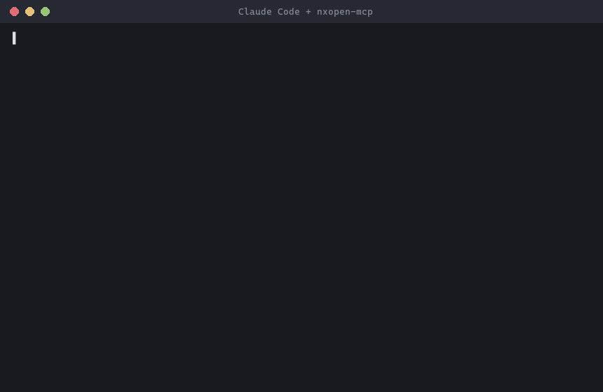

# nxopen-mcp

**English** | [繁體中文](README.zh-TW.md)

MCP server that gives AI coding agents (Claude Code, Codex, Cursor)
accurate knowledge of the Siemens NXOpen .NET API — eliminating
hallucinated API calls via hybrid retrieval over your own NX installation's
official documentation.

## Why

LLMs hallucinate NXOpen APIs: it's a niche domain (Siemens NX CAM/CAD
automation) with sparse public training data, so models confidently invent
classes, methods, and parameters that don't exist. This server grounds
agents in the real docs instead of guesses:

- **Semantic search** (BGE-M3 dense + sparse embeddings) so natural-language
  queries in English or 中文 find the right API even without exact names.
- **Exact-name lookup** so a literal class/member name (e.g. `CavityMillingBuilder`)
  is matched precisely, not just approximately.
- **Exact-name channel**: literal CamelCase tokens in your query are
  looked up directly and pinned to the top (types first).
- **RRF fusion** available to combine channels — though evaluation made
  dense + exact the default (see [Evaluation](#evaluation)).

Everything runs locally and offline against an index built from your own
licensed NX installation — no Siemens files are ever bundled with this
repo or sent anywhere.

## Quick start

Requires **Python 3.11+**.

```bash
# 1. Install from PyPI
pip install "nxopen-mcp[embed,reflect]"

# 2. Build the index from YOUR NX installation (one-time — see time note below)
nxopen-mcp index --nx-path "D:\Siemens\NX12.0"

# 3. Register with Claude Code (user scope: available in every project)
claude mcp add -s user nxopen -- nxopen-mcp serve

# 4. Ask Claude Code to write NXOpen code — it now queries real APIs.
```

`index` looks for `NXOpen*.xml` doc files under `<nx-path>\UGII\managed`
(falling back to `<nx-path>` itself), and for `NXOpen*.dll` assemblies in
the same folder.

Extras: `[embed]` pulls in `FlagEmbedding` (downloads the ~2GB BGE-M3
model on first use) — required for indexing and semantic search.
`[reflect]` pulls in `pythonnet` so `get_class` can show inherited
members; skip it and indexing still works, just without inheritance
chains.

**How long does indexing take?** Honest numbers: a full NX 12 doc set is
~100k members; on an 8-core laptop CPU that's **several hours** of
embedding (memory-bandwidth-bound — `--workers N` helps mainly on
machines with more memory channels; a CUDA GPU helps a lot). Plan to run
it overnight, or copy a teammate's index (see
[Sharing a pre-built index](#sharing-a-pre-built-index)).

**First semantic query is slow by design.** `serve` starts instantly, and
`get_class` / `get_member` respond immediately, but the first
`search_api` / `find_builder` call loads the BGE-M3 model (~1–2 min).
After that, semantic queries take seconds. If your MCP client shows the
first search "hanging", it's the one-time model load — let it finish.

By default the index is written to `~/.nxopen-mcp/index.db`; override with
`--db <path>` on both `index` and `serve`.

If `nxopen-mcp` isn't on your PATH (e.g. installed into a venv), use the
full path to the executable (Windows: `<venv>\Scripts\nxopen-mcp.exe`)
in the commands and configs below.

### `.mcp.json` (Claude Code / other MCP-aware clients)

```json
{
  "mcpServers": {
    "nxopen": {
      "command": "nxopen-mcp",
      "args": ["serve"]
    }
  }
}
```

If you built the index at a non-default path, pass it explicitly:

```json
{
  "mcpServers": {
    "nxopen": {
      "command": "nxopen-mcp",
      "args": ["serve", "--db", "D:\\path\\to\\index.db"]
    }
  }
}
```

### Codex / Cursor

Both tools support stdio MCP servers via a similar config block (Codex's
`~/.codex/config.toml` `[mcp_servers.nxopen]` table, or Cursor's
`mcp.json`). Point `command` at `nxopen-mcp` and `args` at `["serve"]`
(plus `--db` if needed) the same way as above — consult your tool's MCP
docs for the exact config file location and syntax.

## Tools

| tool | purpose |
|---|---|
| `search_api` | Hybrid semantic search over the API (dense + exact-name by default, sparse optional). Accepts English or 中文 queries; use when you don't know the exact class/member name. |
| `get_class` | Full member list for a class, including members inherited from its ancestor chain. Use when you know the class name. |
| `get_member` | Exact signature, parameters, return value, NX version, and license requirement for one member. |
| `find_builder` | Given a CAM operation name (e.g. "cavity milling", "hole drilling"), finds the matching `*Builder` class, its creator method, and a Builder → Commit → Destroy code skeleton. |

## Architecture

```
NXOpen*.xml / *.dll  (your NX install)
        │
        ▼
  indexer/parser.py        one XML doc-comment member -> one MemberRecord
  indexer/inheritance.py   optional: reflect DLLs (pythonnet) for base-class chains
        │
        ▼
  indexer/embedder.py      BGE-M3 dense vector + sparse token weights per record
        │
        ▼
  indexer/build.py         writes members, dense_vec (sqlite-vec), sparse_postings
        │                  into a single SQLite file (index.db)
        ▼
  retrieval/store.py       exact-name lookup, class/member/inheritance queries
  retrieval/hybrid.py      dense ANN + exact CamelCase match (default),
                           optional sparse channel, RRF fusion
        │
        ▼
  server.py                4 MCP tools (FastMCP, stdio transport)
  cli.py                   `nxopen-mcp index` / `nxopen-mcp serve`
```

Design decisions:

- **BYO-Docs licensing.** This repository contains no Siemens XML/DLL
  files. Users point `nxopen-mcp index` at their own licensed NX
  installation; the resulting index is a local SQLite file that never
  leaves the machine and is never committed (see `.gitignore`).
- **One-member-one-chunk.** Each indexed unit is a single API member
  (type, property, method, field, or event) rather than an arbitrary text
  window, so retrieval results map 1:1 onto something an agent can act on
  (a class, a method signature) instead of a fragment of a doc page.
- **RRF fusion, not score blending.** Dense and sparse rankings are
  combined with Reciprocal Rank Fusion, which is scale-free and doesn't
  require calibrating dense-vs-sparse score magnitudes against each other.
  Exact CamelCase name matches are promoted ahead of the fused list
  outright, since a literal name in the query is a much stronger signal
  than similarity.
- **Inheritance via reflection, with graceful degradation.** Ancestor
  chains (needed by `get_class` to show inherited members) are extracted
  by reflecting the NXOpen DLLs with `pythonnet` (`[reflect]` extra) at
  index time. If the extra isn't installed or DLLs aren't found alongside
  the XML docs, indexing still succeeds — `get_class` simply has no
  inherited members to show.

## Evaluation

Measured on a real index built from an NX 12 installation (97,913 API
members) against a 33-query golden set (`eval/golden.jsonl`, mixed
English / Traditional Chinese, four query styles: semantic description,
exact class name, member lookup, builder idiom):

```bash
python eval/run_eval.py --db ~/.nxopen-mcp/index.db
```

| config | Recall@5 | Recall@10 | MRR |
|---|---|---|---|
| dense-only | 69.70% | 78.79% | 0.551 |
| sparse-only | 39.39% | 45.45% | 0.252 |
| **dense+exact (default)** | **69.70%** | **78.79%** | **0.551** |
| dense+sparse+exact | 54.55% | 60.61% | 0.468 |

### With vs. without the tool: hallucination test

Same model (Claude Haiku), same 33 questions, one variable — whether the
nxopen-mcp tools are available. Answers were graded against the golden
set; "hallucinated" means the proposed member does not exist anywhere in
the real 97,913-member index:

| metric | closed-book (no tool) | with nxopen-mcp |
|---|:---:|:---:|
| exactly correct | 13/33 (39.4%) | **31/33 (93.9%)** |
| wrong but real API | 13/33 (39.4%) | 2/33 (6.1%) |
| **hallucinated (API does not exist)** | **7/33 (21.2%)** | **0/33 (0%)** |
| time to answer all 33 | 84 s | 321 s (44 tool calls) |

The closed-book hallucinations are the dangerous kind — plausible names
like `NXOpen.CAM.MillGeometryBuilder` (real name: `MillGeomBuilder`) or
`NXOpen.Session.Parts.Open` (real: `NXOpen.PartCollection.Open`) that
read fine and fail at compile time. Tool-assisted answering costs ~7 s
per question and eliminated hallucinations entirely.

**Evaluation-driven default.** The original design fused dense, sparse
and exact-name channels with uniform RRF. Measurement showed BGE-M3's
sparse channel *hurt* on this corpus: fusing it dragged Recall@5 from
69.7% down to 54.5%, and a weight sweep (w_sparse ∈ {0.5, 0.3, 0.15})
never recovered the dense-only baseline. The exact-name channel — after
reordering its matches (types first, shortest name first, capped at 3)
— matched the dense baseline while guaranteeing literal-name hits. The
default is therefore **dense + exact**; the sparse channel remains
available via the `channels` parameter of `search()`.

## Demo



A real session: asked to write NXOpen code that sets the spindle speed,
Claude Code calls `search_api` (semantic search, English or Chinese) and
`get_class` (members + inheritance chain), then writes code in which every
member — `FeedsBuilder`, `SpindleRpmToggle`, `SpindleRpmBuilder.Value` —
exists in the real API, with NX version info to prove it.

## Sharing a pre-built index

The index is a single SQLite file (~500 MB for a full NX 12 doc set), so
teammates can skip the hours-long build:

1. Install nxopen-mcp (the `[reflect]` extra is not needed — inheritance
   chains are already baked into the index).
2. Copy the index file to `~/.nxopen-mcp/index.db` (or keep it elsewhere
   and pass `--db <path>` to `serve`).
3. Register the server: `claude mcp add -s user nxopen -- nxopen-mcp serve`

The BGE-M3 model (~2 GB) still downloads on the first *semantic* query —
it encodes the query text, independent of the index. Exact lookups
(`get_class` / `get_member`) never need the model.

**Licensing boundary:** the index embeds text from Siemens' API
documentation. Sharing it **within an organization whose seats are
licensed for NX** is reasonable; do **not** redistribute index files
publicly — anyone outside your license should build their own with
`nxopen-mcp index`.

## License & IP

Code: MIT (see [LICENSE](LICENSE)). This repository contains **no**
Siemens files — no NXOpen XML docs, no DLLs. The index is built locally
from your own licensed NX installation's documentation via
`nxopen-mcp index` and never leaves your machine.
