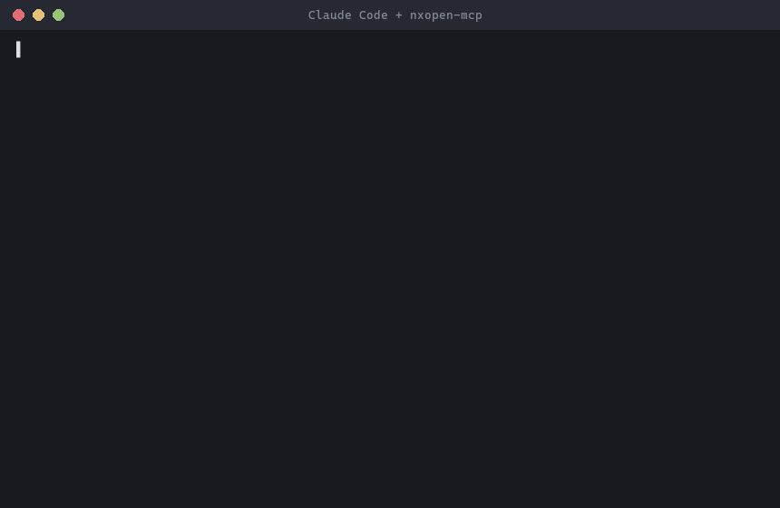

# nxopen-mcp

[English](README.md) | **繁體中文**

讓 AI 編碼代理(Claude Code、Codex、Cursor)精確掌握 Siemens NXOpen .NET
API 的 MCP server——透過對你自己 NX 安裝內官方文件的混合檢索,消除 LLM
幻覺出來的 API 呼叫。

## 為什麼需要它

LLM 會幻覺 NXOpen API:這是一個冷門領域(Siemens NX CAM/CAD 自動化),
公開訓練資料稀少,模型會自信地編造不存在的類別、方法和參數。這個 server
讓代理立足於真實文件而非猜測:

- **語意搜尋**(BGE-M3 dense + sparse 嵌入)——中英文自然語言查詢,
  不知道確切名稱也能找到正確 API。
- **精確名稱通道**:查詢中的字面 CamelCase 名稱(如
  `CavityMillingBuilder`)直接查表並置頂(型別優先),絕不交給
  近似匹配。
- **RRF 融合**可用於合併多通道——但評估結果讓 dense + exact 成為預設
  (見[評估](#評估))。

一切都在本地離線執行,索引由你自己合法授權的 NX 安裝建出——本 repo
不包含任何 Siemens 檔案,也不會將任何資料送出你的機器。

## 快速開始

需要 **Python 3.11+**。

```bash
# 1. 從 PyPI 安裝(或免安裝直接跑:uvx nxopen-mcp)
pip install "nxopen-mcp[embed,reflect]"

# 2. 用「你的」NX 安裝建索引(一次性——耗時說明見下)
nxopen-mcp index --nx-path "D:\Siemens\NX12.0"

# 3. 註冊到 Claude Code(user scope:所有專案皆可用)
claude mcp add -s user nxopen -- nxopen-mcp serve

# 4. 請 Claude Code 寫 NXOpen 程式——它現在查的是真實 API。
```

`index` 會在 `<nx-path>\UGII\managed`(找不到則退回 `<nx-path>` 本身)
尋找 `NXOpen*.xml` 文件檔,並在同目錄尋找 `NXOpen*.dll` 組件。

Extras 說明:`[embed]` 安裝 `FlagEmbedding`(首次使用時下載約 2GB 的
BGE-M3 模型)——建索引與語意搜尋必需。`[reflect]` 安裝 `pythonnet`,
讓 `get_class` 能顯示繼承成員;不裝也能建索引,只是沒有繼承鏈。

**建索引要多久?** 誠實數字:完整 NX 12 文件約 10 萬個成員,8 核筆電
純 CPU 嵌入需要**數小時**(瓶頸在記憶體頻寬——`--workers N` 主要在
記憶體通道較多的機器上有效;有 CUDA GPU 會快很多)。建議掛著過夜跑,
或直接複製同事建好的索引(見[共用建好的索引](#共用建好的索引))。

**第一次語意查詢慢是設計使然。** `serve` 秒啟動、`get_class` /
`get_member` 立即回應,但第一次呼叫 `search_api` / `find_builder`
要載入 BGE-M3 模型(約 1–2 分鐘),之後語意查詢只需數秒。若 MCP
用戶端顯示第一次搜尋「卡住」,那是一次性的模型載入——等它跑完即可。

索引預設寫到 `~/.nxopen-mcp/index.db`;`index` 和 `serve` 都可用
`--db <路徑>` 覆寫。

若 `nxopen-mcp` 不在 PATH 上(例如裝在 venv 裡),以下指令與設定請改用
執行檔完整路徑(Windows:`<venv>\Scripts\nxopen-mcp.exe`)。

### `.mcp.json`(Claude Code / 其他支援 MCP 的用戶端)

```json
{
  "mcpServers": {
    "nxopen": {
      "command": "nxopen-mcp",
      "args": ["serve"]
    }
  }
}
```

若索引建在非預設路徑,明確指定:

```json
{
  "mcpServers": {
    "nxopen": {
      "command": "nxopen-mcp",
      "args": ["serve", "--db", "D:\\path\\to\\index.db"]
    }
  }
}
```

### Codex

Codex CLI 從 `~/.codex/config.toml` 讀取 MCP server 設定
(Windows:`C:\Users\<你的帳號>\.codex\config.toml`,檔案不存在就
自己建立)。加入:

```toml
[mcp_servers.nxopen]
command = "nxopen-mcp"
args = ["serve"]
```

若 `nxopen-mcp` 不在 PATH,改用執行檔完整路徑(Windows 反斜線要寫
兩個):

```toml
[mcp_servers.nxopen]
command = "D:\\path\\to\\venv\\Scripts\\nxopen-mcp.exe"
args = ["serve", "--db", "D:\\path\\to\\index.db"]
```

也可以用一行 CLI 指令完成同樣的事:

```bash
codex mcp add nxopen -- nxopen-mcp serve
```

重啟 Codex 後用 `codex mcp list` 驗證(或直接請它查一個 NXOpen
類別——看到 `nxopen` 的工具呼叫即成功)。第一次語意查詢同樣需要
載入模型(約 1–2 分鐘)。

### Cursor

把上方 `.mcp.json` 的相同 JSON 區塊加進 Cursor 的 MCP 設定
(專案的 `.cursor/mcp.json`,或 Settings → MCP 全域設定)。

## 工具

| 工具 | 用途 |
|---|---|
| `search_api` | API 混合語意搜尋(預設 dense + 精確名稱,sparse 可選)。支援中英文查詢;不知道確切類別/成員名稱時使用。 |
| `get_class` | 列出類別的完整成員,**包含從祖先鏈繼承的成員**。已知類別名稱時使用。 |
| `get_member` | 單一成員的精確簽名、參數、回傳值、NX 版本與授權需求。 |
| `find_builder` | 給定 CAM 操作名稱(如 "cavity milling"、"鑽孔"),找出對應的 `*Builder` 類別、其建立方法,以及 Builder → Commit → Destroy 程式骨架。 |

## 架構

```
NXOpen*.xml / *.dll  (你的 NX 安裝)
        │
        ▼
  indexer/parser.py        一個 XML 文件成員 -> 一筆 MemberRecord
  indexer/inheritance.py   可選:以 pythonnet 反射 DLL 取得父類別鏈
        │
        ▼
  indexer/embedder.py      每筆記錄的 BGE-M3 dense 向量 + sparse 權重
        │
        ▼
  indexer/build.py         將 members、dense_vec (sqlite-vec)、
        │                  sparse_postings 寫入單一 SQLite 檔 (index.db)
        ▼
  retrieval/store.py       精確名稱查詢、類別/成員/繼承鏈查詢
  retrieval/hybrid.py      dense ANN + 精確 CamelCase 比對(預設),
                           sparse 通道可選,RRF 融合
        │
        ▼
  server.py                4 個 MCP 工具(FastMCP,stdio)
  cli.py                   `nxopen-mcp index` / `nxopen-mcp serve`
```

設計決策:

- **BYO-Docs 授權設計。** 本 repo 不含任何 Siemens XML/DLL 檔案。
  使用者將 `nxopen-mcp index` 指向自己合法授權的 NX 安裝;產出的索引是
  本地 SQLite 檔,不離開機器、不進版控(見 `.gitignore`)。
- **一成員一 chunk。** 每個索引單位是單一 API 成員(型別、屬性、方法、
  欄位或事件),而非任意文字視窗——檢索結果 1:1 對應到代理可直接使用的
  東西(一個類別、一個方法簽名),而非文件頁的片段。
- **RRF 融合,而非分數混合。** 啟用 sparse 通道時,dense 與 sparse
  排名以 Reciprocal Rank Fusion 合併——與分數尺度無關,不需校準兩者
  的分數量級(經評估的預設值僅跑 dense + exact)。查詢中的字面
  CamelCase 名稱直接置頂於融合結果之前,因為字面名稱是遠強於相似度的
  訊號。
- **繼承鏈靠反射,並可優雅降級。** 祖先鏈(`get_class` 顯示繼承成員
  所需)在建索引時以 `pythonnet`(`[reflect]` extra)反射 NXOpen DLL
  取得。若未安裝該 extra 或 XML 旁找不到 DLL,建索引仍會成功——只是
  `get_class` 沒有繼承成員可顯示。

## 評估

以真實 NX 12 安裝建出的索引(97,913 個 API 成員)、33 題 golden set
(`eval/golden.jsonl`,中英混合,四種查詢型態:語意描述、精確類別名、
成員查詢、Builder 慣用法)實測:

```bash
python eval/run_eval.py --db ~/.nxopen-mcp/index.db
```

| 配置 | Recall@5 | Recall@10 | MRR |
|---|---|---|---|
| 僅 dense | 69.70% | 78.79% | 0.551 |
| 僅 sparse | 39.39% | 45.45% | 0.252 |
| **dense+exact(預設)** | **69.70%** | **78.79%** | **0.551** |
| dense+sparse+exact | 54.55% | 60.61% | 0.468 |

### 有工具 vs. 無工具:幻覺測試

同一個模型(Claude Haiku)、同樣 33 題,唯一變數是有沒有 nxopen-mcp
工具。答案對照 golden set 評分;「幻覺」指提出的成員在真實的 97,913
筆索引中完全不存在:

| 指標 | closed-book(無工具) | 有 nxopen-mcp |
|---|:---:|:---:|
| 完全正確 | 13/33 (39.4%) | **31/33 (93.9%)** |
| 答錯但 API 存在 | 13/33 (39.4%) | 2/33 (6.1%) |
| **幻覺(API 不存在)** | **7/33 (21.2%)** | **0/33 (0%)** |
| 33 題總耗時 | 84 秒 | 321 秒(44 次工具呼叫) |

無工具的幻覺是最危險的那種——像 `NXOpen.CAM.MillGeometryBuilder`
(真名:`MillGeomBuilder`)或 `NXOpen.Session.Parts.Open`(真名:
`NXOpen.PartCollection.Open`)這樣讀起來很合理、編譯才失敗的名字。
工具輔助每題多花約 7 秒,並完全消除了幻覺。

**評估驅動的預設值。** 原始設計以均權 RRF 融合 dense、sparse 與精確
名稱三通道。實測顯示 BGE-M3 的 sparse 通道在此語料上*有害*:融合它使
Recall@5 從 69.7% 掉到 54.5%,權重掃描(w_sparse ∈ {0.5, 0.3, 0.15})
也無法追回 dense-only 基準。精確名稱通道在重排其結果後(型別優先、
短名優先、上限 3 筆)追平 dense 基準,同時保證字面名稱必命中。因此
預設為 **dense + exact**;sparse 通道仍可經 `search()` 的 `channels`
參數啟用。

## Demo



真實 session:Claude Code 回答「幫我寫一個設定主軸轉速的 NXOpen 程式」
時,呼叫 `search_api`(中英文語意搜尋)與 `get_class`(成員 + 繼承鏈),
然後寫出的程式中每個成員——`FeedsBuilder`、`SpindleRpmToggle`、
`SpindleRpmBuilder.Value`——都真實存在於 API 中,並附 NX 版本資訊佐證。

## 共用建好的索引

索引是單一 SQLite 檔(完整 NX 12 文件約 500 MB),同事可以跳過數小時
的建置:

1. 安裝 nxopen-mcp(不需要 `[reflect]` extra——繼承鏈已包含在索引中)。
2. 把索引檔複製到 `~/.nxopen-mcp/index.db`(或放別處,`serve` 時傳
   `--db <路徑>`)。
3. 註冊 server:`claude mcp add -s user nxopen -- nxopen-mcp serve`

完整的從零串接教學(含疑難排解):[使用現成索引串接指南](docs/setup-prebuilt-index.zh-TW.md)。

BGE-M3 模型(約 2 GB)在第一次*語意*查詢時仍會下載——它負責編碼查詢
文字,與索引無關。精確查詢(`get_class` / `get_member`)永遠不需要
模型。

**授權界線:**索引內嵌 Siemens API 文件的文字。在**席位皆有 NX 授權的
組織內部**共用是合理的;請**勿**公開散布索引檔——授權範圍外的任何人
應以 `nxopen-mcp index` 自行建置。

## 授權與智慧財產

程式碼:MIT(見 [LICENSE](LICENSE))。本 repo **不含**任何 Siemens
檔案——沒有 NXOpen XML 文件、沒有 DLL。索引由你自己合法授權的 NX
安裝文件透過 `nxopen-mcp index` 在本地建置,永不離開你的機器。
